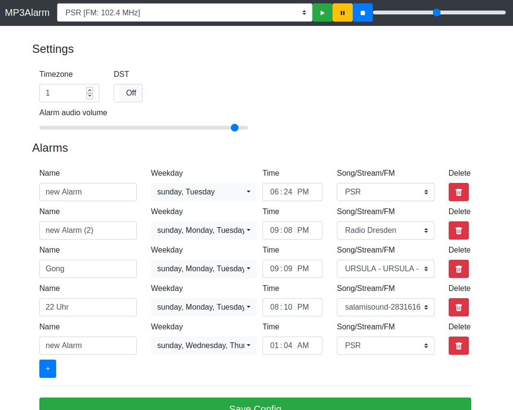
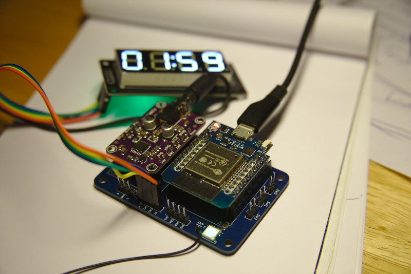
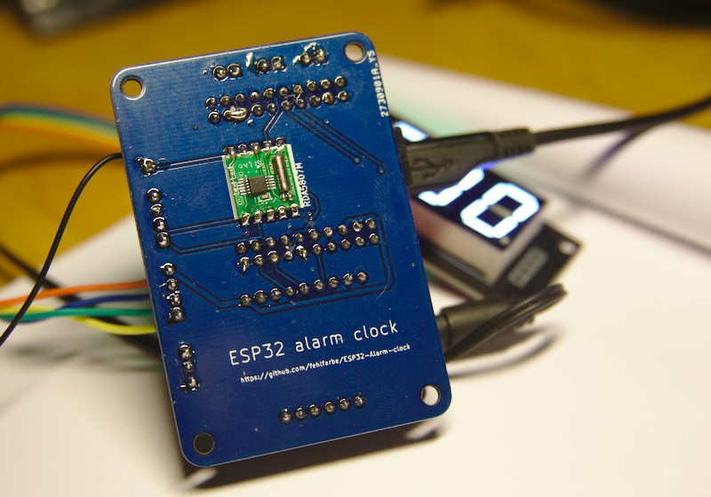
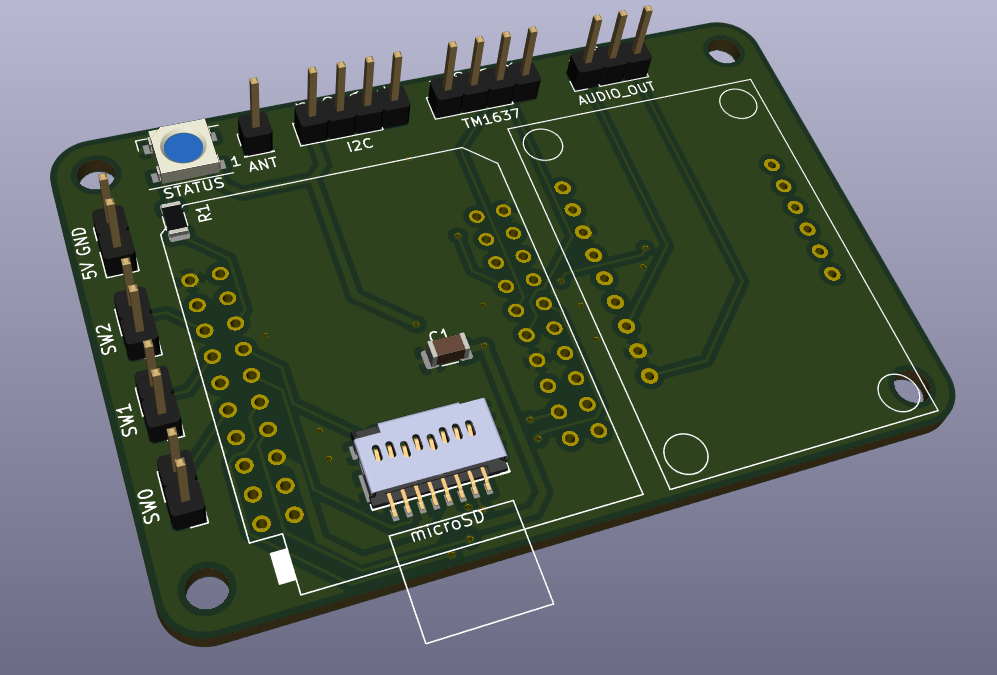
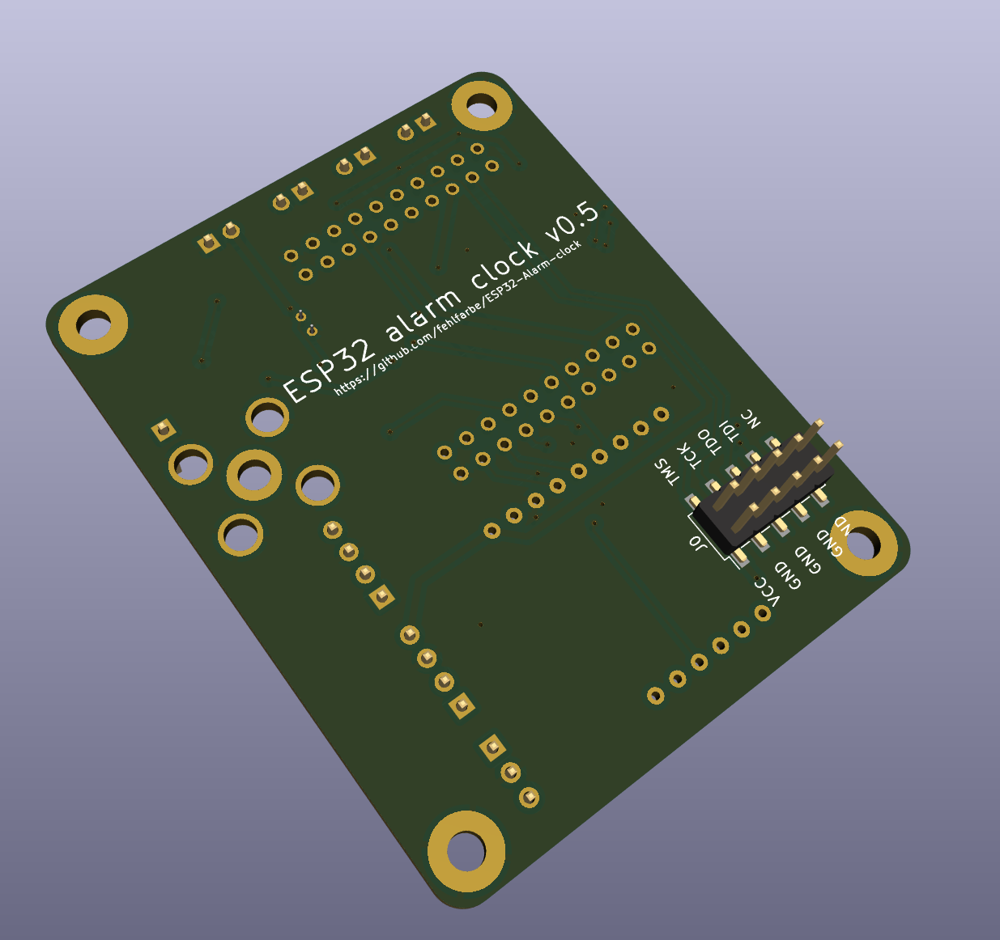

# ESP32 Alarm clock

This is an ESP32 based alarm clock that plays mp3 files from SD, webstreams or even FM radio.
You can configure multiple alarms and add new songs to your sd card with a simple webinterface.

Photos of older PCB version:

## Featues

- designed for ESP32 microcontrollers
- plays audio from different sources:
  - MP3/AAC from SD
  - webstreams via WiFi
  - FM radio via [RDA5807FP](https://opendevices.ru/wp-content/uploads/2015/10/RDA5807FP.pdf) module
- output via I2S to a stereo decoder like the [UDA1334A](https://learn.adafruit.com/adafruit-i2s-stereo-decoder-uda1334a).
- see current time on TM1637 4-Digit Digital LED display
- see current WiFi state with WS2812 RGB LED
- simple config and file upload via webinterface

## Hardware

### Parts

- ESP32 board: <https://www.aliexpress.com/item/32839344778.html>
- UDA1334A I2S audio board: <https://de.aliexpress.com/item/4000373056838.html> or <https://www.adafruit.com/product/3678>
- microSD adapter: <https://www.mouser.de/ProductDetail/538-105162-0001/>
- FM Stereo Radio Modul RDA5807FP <https://de.aliexpress.com/item/1005003182980216.html>
- Sime wire as FM antenna or RF Socket and FM antenna <https://de.aliexpress.com/item/1005003995713288.html>
- TM1637 4-Digit Digital LED 0,56 Display (optional): <https://de.aliexpress.com/item/32843855386.html>
- 2x WS2812B SMD LED to display WiFi state (optional): <https://de.aliexpress.com/item/32891331762.html>
- microSD card adapter (Molex 1051620001): <https://www.digikey.de/en/products/detail/molex/1051620001/6133135>
- microSD card
- some pin headers and cables to connect the display
- some 1206 resistors and capacitors, a 32.768Khz oscillator, smd elko
- headphones or active speakers

### Breakout board

The breakout board PCB connects all parts

The KiCAD project and gerber files are available at `hardware/pcb/mp3alarm`

### WiFiLED States

-  no WiFi connection
-  connecting to WiFi
-  connected
-  accesspoint active

## Installation

Just clone the project and open it in platformIO. PIO will download all necessary libs. Connect the ESP32 on your USB port an click "Upload" in PIO. After this open a terminal in PIO and run `pio run -t uploadfs` to upload the webinterface to ESP32's flash.
The ESP32 will reboot and opens an accesspoint where you can connect to your WiFi. The clock is synced over the internet via NTP.

## ToDo

[ ] Add alarm timeout (for webstreams, radio etc.)
[ ] Switches have no function yet
[ ] better web UI based on react
[ ] pictures of full assembled board
[ ] complete BOM list