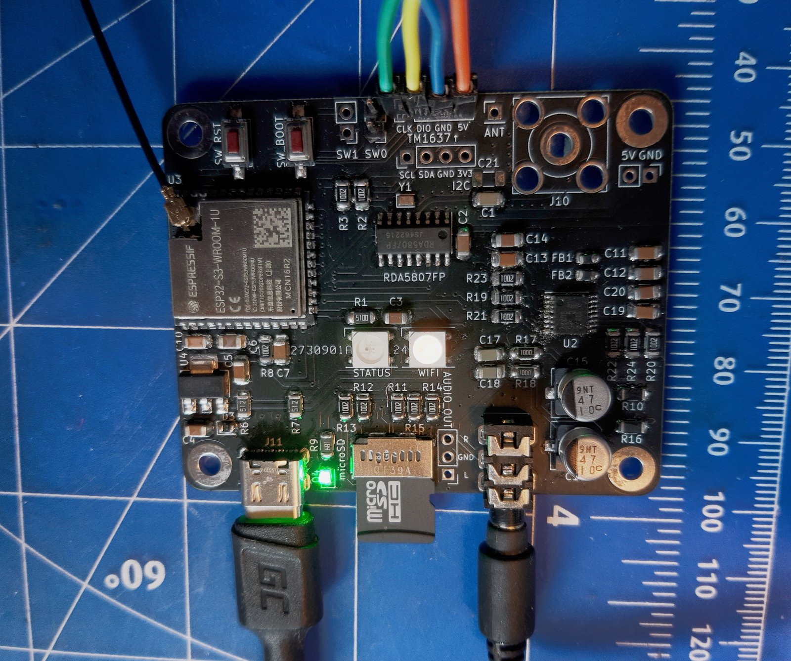
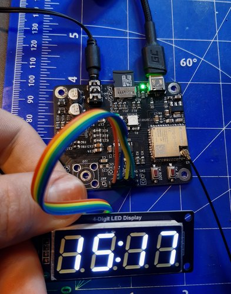
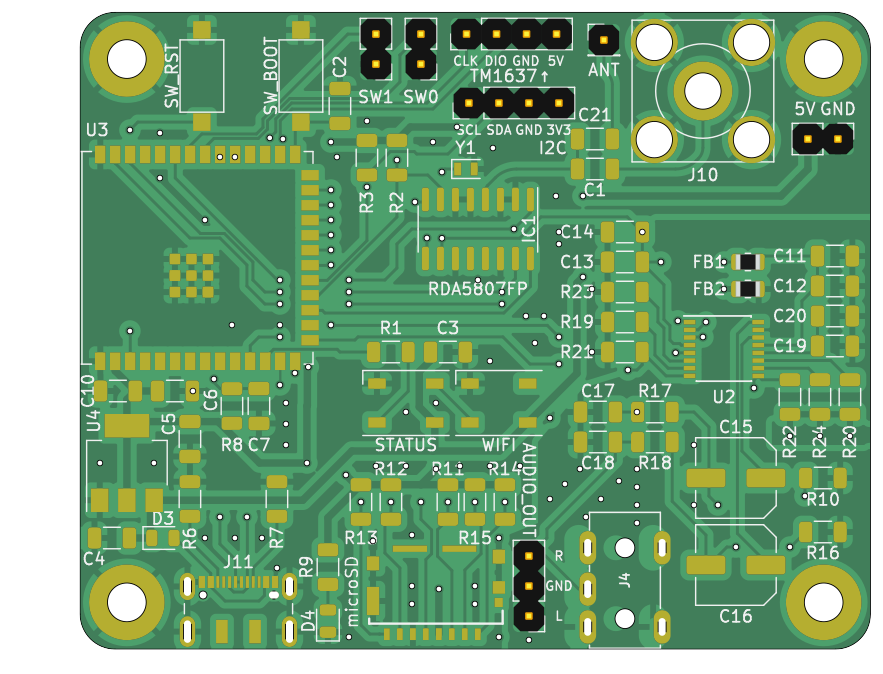
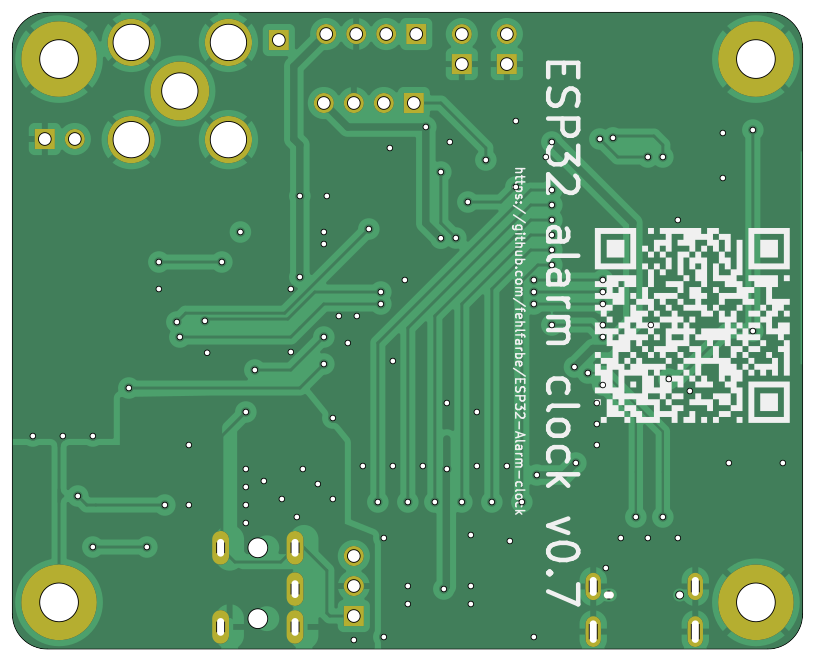
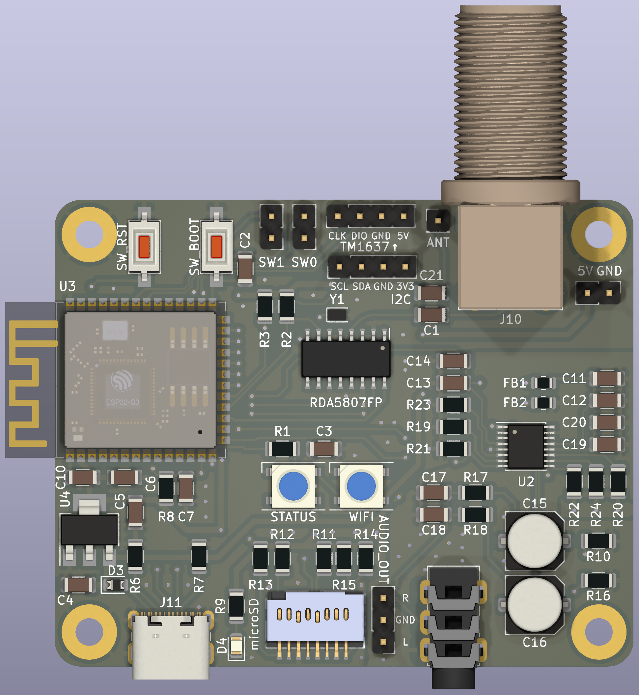
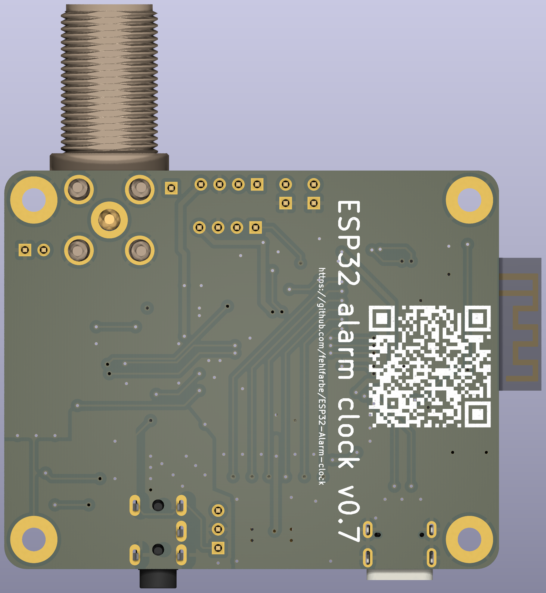

# ESP32 Alarm clock

This is an ESP32 based alarm clock that plays mp3 files from SD, webstreams or even FM radio.
You can configure multiple alarms and add new songs to your sd card with a simple webinterface.

Photos of the current PCB version (without assembled radio antenna connector J10):

## Features

- designed for ESP32 S3 microcontroller
- plays audio from different sources:
  - MP3/AAC from SD
  - webstreams via WiFi
  - FM radio via [RDA5807FP](https://opendevices.ru/wp-content/uploads/2015/10/RDA5807FP.pdf) module
- output via I2S to a stereo decoder like the [UDA1334A](https://learn.adafruit.com/adafruit-i2s-stereo-decoder-uda1334a).
- see current time on TM1637 4-Digit Digital LED display
- see current WiFi state with WS2812 RGB LED
- simple config and file upload via webinterface

## Hardware

The KiCAD project and gerber files are available at `hardware/pcb/`

### Schematic

### 2D Plot

#### Front

#### Back

### 3D Render

#### Front

#### Back

### BOM

`hardware/pcb/export/BOM.xml`

## LED States

### Status LED

-  1Hz blinking: An Error has occurred while mounting LITTLEFS
-  0.5Hz blinking: Cannot mount SD card
-  Everything is fine :)

### WiFi LED

-   AccessPoint mode: Connect to the ESP's access point and configure your WiFi
-  ... WiFi signal strength from bad to good

## Installation

Just clone the project and open it in platformIO. PIO will download all necessary libs. Connect the ESP32 on your USB port an click "Upload" in PIO. After this open a terminal in PIO and run `pio run -t uploadfs` to upload the webinterface to ESP32's flash.
The ESP32 will reboot and opens an accesspoint where you can connect to your WiFi. The clock is synced over the internet via NTP.

## ToDo

- [ ] Add alarm timeout (for webstreams, radio etc.)
- [ ] better web UI based on react
- [x] pictures of full assembled board
- [ ] complete BOM list